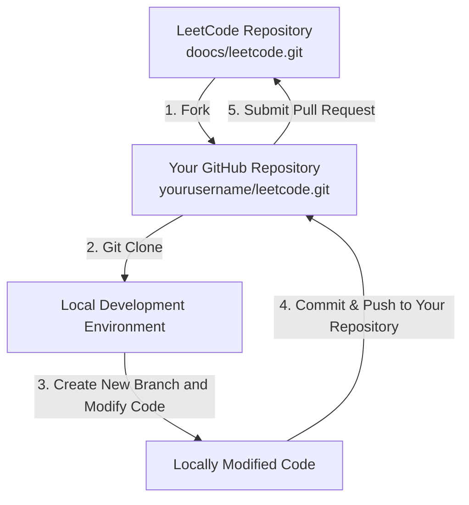

<p align="center">
  <a href="https://github.com/Optimism-Educator/leetcode">
    
  </a>
</p>

<p align="center">
  <a href="https://doocs.github.io/#/?id=how-to-join">
    
  </a>
  <a href="https://github.com/doocs/leetcode">
    
  </a>
  <a href="https://github.com/doocs/leetcode/blob/main/LICENSE">
    
  </a>
  <br>
  <a href="https://opencollective.com/doocs-leetcode/backers/badge.svg" alt="backers on Open Collective">
    
  </a>
  <a href="https://github.com/doocs/leetcode/stargazers">
    
  </a>
  <a href="https://github.com/doocs/leetcode/network/members">
    
  </a>
  <a href="https://opencollective.com/doocs-leetcode/sponsors/badge.svg" alt="Sponsors on Open Collective">
    
  </a>
</p>

## Introduction

This project contains solutions for problems from LeetCode, *JianZhi Offer (2nd Edition)*, *JianZhi Offer: Special Training*, and *Cracking the Coding Interview (6th Edition)*, among others. All solutions are implemented in multiple programming languages, including but not limited to: Java, Python, C++, Go, TypeScript, and Rust. We are continuously updating the repository – feel free to star [this project](https://github.com/doocs/leetcode) and follow for the latest updates.

[中文版](/README_CN.md)

## Website

https://leetcode.doocs.org

## Comprehensive Algorithms Solutions

- [LeetCode Solutions](/solution/README.md)
- [Past Contests Collection](/solution/CONTEST_README.md)
- [JianZhi Offer (2nd Edition)](/lcof/README.md)
- [JianZhi Offer: Special Training](/lcof2/README.md)
- [Cracking the Coding Interview (6th Edition)](/lcci/README.md)

## Special Practice

- [JavaScript Practice](/solution/JAVASCRIPT_README.md)
- [Database Practice](/solution/DATABASE_README.md)

## Advanced Algorithm Topics

### 1. Basic Algorithms

- [Find First and Last Position of Element in Sorted Array](/solution/0000-0099/0034.Find%20First%20and%20Last%20Position%20of%20Element%20in%20Sorted%20Array/README.md) — `Binary Search`
- [Minimum Speed to Arrive on Time](/solution/1800-1899/1870.Minimum%20Speed%20to%20Arrive%20on%20Time/README.md) — `Binary Search`
- [Maximum Number of Removable Characters](/solution/1800-1899/1898.Maximum%20Number%20of%20Removable%20Characters/README.md) — `Binary Search`
- [Sort an Array](/solution/0900-0999/0912.Sort%20an%20Array/README.md) — `Quick Sort`, `Merge Sort`
- [Add Strings](/solution/0400-0499/0415.Add%20Strings/README.md) — `High-Precision Addition`
- [Multiply Strings](/solution/0000-0099/0043.Multiply%20Strings/README.md) — `High-Precision Multiplication`
- [Range Sum Query - Immutable](/solution/0300-0399/0303.Range%20Sum%20Query%20-%20Immutable/README.md) — `Prefix Sum`
- [Range Sum Query 2D - Immutable](/solution/0300-0399/0304.Range%20Sum%20Query%202D%20-%20Immutable/README.md) — `2D Prefix Sum`
- [Range Addition](/solution/0300-0399/0370.Range%20Addition/README.md) — `Prefix Sum`, `Difference Array`
- [Stamping the Grid](/solution/2100-2199/2132.Stamping%20the%20Grid/README.md) — `2D Prefix Sum`, `2D Difference Array`
- [Longest Substring Without Repeating Characters](/solution/0000-0099/0003.Longest%20Substring%20Without%20Repeating%20Characters/README.md) — `Two Pointers`, `Hash Table`
- [Subarray Product Less Than K](/solution/0700-0799/0713.Subarray%20Product%20Less%20Than%20K/README.md) — `Two Pointers`
- [Number of 1 Bits](/solution/0100-0199/0191.Number%20of%201%20Bits/README.md) — `Bit Manipulation`, `Lowbit`
- [Merge Intervals](/solution/0000-0099/0056.Merge%20Intervals/README.md) — `Interval Merging`

### 2. Data Structures

- [Design Linked List](/solution/0700-0799/0707.Design%20Linked%20List/README.md) — `Singly Linked List`, `Pointer References`, `Array Implementation`
- [Next Greater Element I](/solution/0400-0499/0496.Next%20Greater%20Element%20I/README.md) — `Monotonic Stack`
- [Daily Temperatures](/solution/0700-0799/0739.Daily%20Temperatures/README.md) — `Monotonic Stack`
- [Sum of Subarray Minimums](/solution/0900-0999/0907.Sum%20of%20Subarray%20Minimums/README.md) — `Monotonic Stack`
- [Maximum Width Ramp](/solution/0900-0999/0962.Maximum%20Width%20Ramp/README.md) — `Monotonic Stack`
- [Max Chunks To Make Sorted II](/solution/0700-0799/0768.Max%20Chunks%20To%20Make%20Sorted%20II/README.md) — `Monotonic Stack`
- [Sum of Subarray Ranges](/solution/2100-2199/2104.Sum%20of%20Subarray%20Ranges/README.md) — `Monotonic Stack`
- [Maximum Subarray Min-Product](/solution/1800-1899/1856.Maximum%20Subarray%20Min-Product/README.md) — `Monotonic Stack`
- [Sliding Window Maximum](/solution/0200-0299/0239.Sliding%20Window%20Maximum/README.md) — `Monotonic Queue`
- [Max Value of Equation](/solution/1400-1499/1499.Max%20Value%20of%20Equation/README.md) — `Monotonic Queue`
- [Shortest Subarray with Sum at Least K](/solution/0800-0899/0862.Shortest%20Subarray%20with%20Sum%20at%20Least%20K/README.md) — `Monotonic Queue`
- [Constrained Subsequence Sum](/solution/1400-1499/1425.Constrained%20Subsequence%20Sum/README.md) — `Dynamic Programming`, `Monotonic Queue Optimization`
- [Word Pattern II](/solution/0200-0299/0291.Word%20Pattern%20II/README.md) — `Hash Table`, `Backtracking`
- [Shortest Palindrome](/solution/0200-0299/0214.Shortest%20Palindrome/README.md) — `String Hashing`
- [Palindrome Pairs](/solution/0300-0399/0336.Palindrome%20Pairs/README.md) — `String Hashing`
- [Longest Duplicate Substring](/solution/1000-1099/1044.Longest%20Duplicate%20Substring/README.md) — `String Hashing`, `Binary Search`
- [Distinct Echo Substrings](/solution/1300-1399/1316.Distinct%20Echo%20Substrings/README.md) — `String Hashing`

### 3. Search

- [Flood Fill](/solution/0700-0799/0733.Flood%20Fill/README.md) — `BFS`, `DFS`, `Flood Fill Algorithm`, `Connectivity Model`
- [Number of Islands](/solution/0200-0299/0200.Number%20of%20Islands/README.md) — `BFS`, `Flood Fill Algorithm`
- [01 Matrix](/solution/0500-0599/0542.01%20Matrix/README.md) — `Multi-source BFS`
- [Map of Highest Peak](/solution/1700-1799/1765.Map%20of%20Highest%20Peak/README.md) — `Multi-source BFS`
- [Minimum Knight Moves](/solution/1100-1199/1197.Minimum%20Knight%20Moves/README.md) — `BFS`, `Shortest Path Model`
- [Shortest Path in Binary Matrix](/solution/1000-1099/1091.Shortest%20Path%20in%20Binary%20Matrix/README.md) — `BFS`, `Shortest Path Model`
- [Nearest Exit from Entrance in Maze](/solution/1900-1999/1926.Nearest%20Exit%20from%20Entrance%20in%20Maze/README.md) — `BFS`, `Shortest Path Model`
- [Shortest Path in a Grid with Obstacles Elimination](/solution/1200-1299/1293.Shortest%20Path%20in%20a%20Grid%20with%20Obstacles%20Elimination/README.md) — `BFS`, `Shortest Path Model`
- [Open the Lock](/solution/0700-0799/0752.Open%20the%20Lock/README.md) — `Minimum Step Model`, `Bidirectional BFS`, `A* Algorithm`
- [Word Ladder](/solution/0100-0199/0127.Word%20Ladder/README.md) — `Minimum Step Model`, `Bidirectional BFS`
- [Minimum Operations to Convert Number](/solution/2000-2099/2059.Minimum%20Operations%20to%20Convert%20Number/README.md) — `Minimum Step Model`, `Bidirectional BFS`
- [Sliding Puzzle](/solution/0700-0799/0773.Sliding%20Puzzle/README.md) — `BFS`, `Minimum Step Model`, `A* Algorithm`
- [Shortest Path Visiting All Nodes](/solution/0800-0899/0847.Shortest%20Path%20Visiting%20All%20Nodes/README.md) — `BFS`, `Minimum Step Model`, `A* Algorithm`
- [Cut Off Trees for Golf Event](/solution/0600-0699/0675.Cut%20Off%20Trees%20for%20Golf%20Event/README.md) — `BFS`, `A* Algorithm`
- [Minimum Cost to Make at Least One Valid Path in a Grid](/solution/1300-1399/1368.Minimum%20Cost%20to%20Make%20at%20Least%20One%20Valid%20Path%20in%20a%20Grid/README.md) — `Deque-based BFS`
- [Minimum Obstacle Removal to Reach Corner](/solution/2200-2299/2290.Minimum%20Obstacle%20Removal%20to%20Reach%20Corner/README.md) — `Deque-based BFS`
- [The Maze](/solution/0400-0499/0490.The%20Maze/README.md) — `DFS`, `Connectivity Model`, `Flood Fill Algorithm`
- [Word Search](/solution/0000-0099/0079.Word%20Search/README.md) — `DFS`, `Search Order`, `Backtracking`
- [Path with Maximum Gold](/solution/1200-1299/1219.Path%20with%20Maximum%20Gold/README.md) — `DFS`, `Search Order`, `Backtracking`
- [Matchsticks to Square](/solution/0400-0499/0473.Matchsticks%20to%20Square/README.md) — `DFS`, `Backtracking`, `Pruning`
- [Partition to K Equal Sum Subsets](/solution/0600-0699/0698.Partition%20to%20K%20Equal%20Sum%20Subsets/README.md) — `DFS`, `Backtracking`, `Pruning`
- [Find Minimum Time to Finish All Jobs](/solution/1700-1799/1723.Find%20Minimum%20Time%20to%20Finish%20All%20Jobs/README.md) — `DFS`, `Backtracking`, `Pruning`
- [Fair Distribution of Cookies](/solution/2300-2399/2305.Fair%20Distribution%20of%20Cookies/README.md) — `DFS`, `Backtracking`, `Pruning`
- [Longest Increasing Path in a Matrix](/solution/0300-0399/0329.Longest%20Increasing%20Path%20in%20a%20Matrix/README.md) — `DFS`, `Memoization`
- [Number of Increasing Paths in a Grid](/solution/2300-2399/2328.Number%20of%20Increasing%20Paths%20in%20a%20Grid/README.md) — `DFS`, `Memoization`
- [Flip Game II](/solution/0200-0299/0294.Flip%20Game%20II/README.md) — `DFS`, `State Compression`, `Memoization`
- [Count All Possible Routes](/solution/1500-1599/1575.Count%20All%20Possible%20Routes/README.md) — `DFS`, `Memoization`
- [Number of Ways of Cutting a Pizza](/solution/1400-1499/1444.Number%20of%20Ways%20of%20Cutting%20a%20Pizza/README.md) — `DFS`, `Memoization`

### 4. Dynamic Programming (DP)

- [Pascal's Triangle](/solution/0100-0199/0118.Pascal's%20Triangle/README.md) — `Linear DP`, `Triangle Model`
- [Minimum Path Sum](/solution/0000-0099/0064.Minimum%20Path%20Sum/README.md) — `Linear DP`, `Triangle Model`
- [Cherry Pickup](/solution/0700-0799/0741.Cherry%20Pickup/README.md) — `Linear DP`, `Triangle Model`
- [Cherry Pickup II](/solution/1400-1499/1463.Cherry%20Pickup%20II/README.md) — `Linear DP`, `Triangle Model`
- [Longest Increasing Subsequence](/solution/0300-0399/0300.Longest%20Increasing%20Subsequence/README.md) — `Linear DP`, `Longest Increasing Subsequence Model`
- [Non-overlapping Intervals](/solution/0400-0499/0435.Non-overlapping%20Intervals/README.md) — `Linear DP`, `Longest Increasing Subsequence Model`, `Greedy Optimization`
- [Delete Columns to Make Sorted III](/solution/0900-0999/0960.Delete%20Columns%20to%20Make%20Sorted%20III/README.md) — `Linear DP`, `Longest Increasing Subsequence Model`
- [Russian Doll Envelopes](/solution/0300-0399/0354.Russian%20Doll%20Envelopes/README.md) — `Linear DP`, `Longest Increasing Subsequence Model`, `Greedy Optimization`
- [Maximum Height by Stacking Cuboids](/solution/1600-1699/1691.Maximum%20Height%20by%20Stacking%20Cuboids/README.md) — `Sorting`, `Linear DP`, `Longest Increasing Subsequence Model`
- [Best Team With No Conflicts](/solution/1600-1699/1626.Best%20Team%20With%20No%20Conflicts/README.md) — `Sorting`, `Linear DP`, `Longest Increasing Subsequence Model`
- [Longest Common Subsequence](/solution/1100-1199/1143.Longest%20Common%20Subsequence/README.md) — `Linear DP`, `Longest Common Subsequence Model`
- [Minimum ASCII Delete Sum for Two Strings](/solution/0700-0799/0712.Minimum%20ASCII%20Delete%20Sum%20for%20Two%20Strings/README.md) — `Linear DP`, `Longest Common Subsequence Model`
- [Delete Operation for Two Strings](/solution/0500-0599/0583.Delete%20Operation%20for%20Two%20Strings/README.md) — `Linear DP`, `Longest Common Subsequence Model`
- [Target Sum](/solution/0400-0499/0494.Target%20Sum/README.md) — `0-1 Knapsack`
- [Partition Equal Subset Sum](/solution/0400-0499/0416.Partition%20Equal%20Subset%20Sum/README.md) — `0-1 Knapsack`
- [Last Stone Weight II](/solution/1000-1099/1049.Last%20Stone%20Weight%20II/README.md) — `0-1 Knapsack`
- [Coin Change](/solution/0300-0399/0322.Coin%20Change/README.md) — `Complete Knapsack`
- [Combination Sum IV](/solution/0300-0399/0377.Combination%20Sum%20IV/README.md) — `Complete Knapsack`
- [Maximum Value of K Coins From Piles](/solution/2200-2299/2218.Maximum%20Value%20of%20K%20Coins%20From%20Piles/README.md) — `Grouped Knapsack`
- [Number of Digit One](/solution/0200-0299/0233.Number%20of%20Digit%20One/README.md) — `Digit DP`, `Memoization`
- [Count Numbers with Unique Digits](/solution/0300-0399/0357.Count%20Numbers%20with%20Unique%20Digits/README.md) — `Digit DP`, `Memoization`, `State Compression`
- [Non-negative Integers without Consecutive Ones](/solution/0600-0699/0600.Non-negative%20Integers%20without%20Consecutive%20Ones/README.md) — `Digit DP`, `Memoization`
- [Rotated Digits](/solution/0700-0799/0788.Rotated%20Digits/README.md) — `Digit DP`, `Memoization`
- [Numbers At Most N Given Digit Set](/solution/0900-0999/0902.Numbers%20At%20Most%20N%20Given%20Digit%20Set/README.md) — `Digit DP`, `Memoization`
- [Count Special Integers](/solution/2300-2399/2376.Count%20Special%20Integers/README.md) — `Digit DP`, `Memoization`

### 5. Advanced Data Structures

- [Detect Cycles in 2D Grid](/solution/1500-1599/1559.Detect%20Cycles%20in%202D%20Grid/README.md) — `Union Find`, `Cycle Detection`
- [Evaluate Division](/solution/0300-0399/0399.Evaluate%20Division/README.md) — `Union Find`, `Weight Maintenance`
- [Regions Cut By Slashes](/solution/0900-0999/0959.Regions%20Cut%20By%20Slashes/README.md) — `Union Find`, `Connected Components`
- [Swim in Rising Water](/solution/0700-0799/0778.Swim%20in%20Rising%20Water/README.md) — `Union Find`
- [Smallest String With Swaps](/solution/1200-1299/1202.Smallest%20String%20With%20Swaps/README.md) — `Union Find`
- [Bricks Falling When Hit](/solution/0800-0899/0803.Bricks%20Falling%20When%20Hit/README.md) — `Union Find`, `Reverse Thinking`
- [Minimize Malware Spread II](/solution/0900-0999/0928.Minimize%20Malware%20Spread%20II/README.md) — `Union Find`, `Reverse Thinking`
- [Checking Existence of Edge Length Limited Paths](/solution/1600-1699/1697.Checking%20Existence%20of%20Edge%20Length%20Limited%20Paths/README.md) — `Union Find`, `Offline Processing`
- [Remove Max Number of Edges to Keep Graph Fully Traversable](/solution/1500-1599/1579.Remove%20Max%20Number%20of%20Edges%20to%20Keep%20Graph%20Fully%20Traversable/README.md) — `Dual Union Find`
- [Range Sum Query - Mutable](/solution/0300-0399/0307.Range%20Sum%20Query%20-%20Mutable/README.md) — `Binary Indexed Tree`, `Segment Tree`
- [Create Sorted Array through Instructions](/solution/1600-1699/1649.Create%20Sorted%20Array%20through%20Instructions/README.md) — `Binary Indexed Tree`, `Segment Tree`
- [Count Good Triplets in an Array](/solution/2100-2199/2179.Count%20Good%20Triplets%20in%20an%20Array/README.md) — `Binary Indexed Tree`, `Segment Tree`
- [Minimum Possible Integer After at Most K Adjacent Swaps on Digits](/solution/1500-1599/1505.Minimum%20Possible%20Integer%20After%20at%20Most%20K%20Adjacent%20Swaps%20On%20Digits/README.md) — `Binary Indexed Tree`
- [Range Sum Query 2D - Mutable](/solution/0300-0399/0308.Range%20Sum%20Query%202D%20-%20Mutable/README.md) — `2D Binary Indexed Tree`, `Segment Tree`
- [Count of Smaller Numbers After Self](/solution/0300-0399/0315.Count%20of%20Smaller%20Numbers%20After%20Self/README.md) — `Discretization + Binary Indexed Tree`, `Segment Tree`
- [Count of Range Sum](/solution/0300-0399/0327.Count%20of%20Range%20Sum/README.md) — `Discretization + Binary Indexed Tree`, `Segment Tree`
- [Reverse Pairs](/solution/0400-0499/0493.Reverse%20Pairs/README.md) — `Discretization + Binary Indexed Tree`, `Merge Sort`, `Segment Tree`
- [Number of Longest Increasing Subsequence](/solution/0600-0699/0673.Number%20of%20Longest%20Increasing%20Subsequence/README.md) — `Discretization + Binary Indexed Tree`, `Range Maximum Query`
- [Fancy Sequence](/solution/1600-1699/1622.Fancy%20Sequence/README.md) — `Dynamic Segment Tree`, `Lazy Propagation`
- [Range Module](/solution/0700-0799/0715.Range%20Module/README.md) — `Dynamic Segment Tree`, `Lazy Propagation`
- [My Calendar III](/solution/0700-0799/0732.My%20Calendar%20III/README.md) — `Dynamic Segment Tree`, `Lazy Propagation`
- [Amount of New Area Painted Each Day](/solution/2100-2199/2158.Amount%20of%20New%20Area%20Painted%20Each%20Day/README.md) — `Dynamic Segment Tree`, `Lazy Propagation`, `Interval Coloring`
- [Longest Substring of One Repeating Character](/solution/2200-2299/2213.Longest%20Substring%20of%20One%20Repeating%20Character/README.md) — `Segment Tree`, `Dynamic Maximum Subarray Sum Model`
- [Rectangle Area II](/solution/0800-0899/0850.Rectangle%20Area%20II/README.md) — `Segment Tree`, `Discretization`, `Scanline`

### 6. Graph Theory

- [Network Delay Time](/solution/0700-0799/0743.Network%20Delay%20Time/README.md) — `Shortest Path`, `Dijkstra's Algorithm`, `Bellman-Ford Algorithm`, `SPFA`
- [Minimum Weighted Subgraph With the Required Paths](/solution/2200-2299/2203.Minimum%20Weighted%20Subgraph%20With%20the%20Required%20Paths/README.md) — `Shortest Path`, `Dijkstra's Algorithm`
- [Min Cost to Connect All Points](/solution/1500-1599/1584.Min%20Cost%20to%20Connect%20All%20Points/README.md) — `Minimum Spanning Tree`, `Prim's Algorithm`, `Kruskal's Algorithm`
- [Connecting Cities With Minimum Cost](/solution/1100-1199/1135.Connecting%20Cities%20With%20Minimum%20Cost/README.md) — `Minimum Spanning Tree`, `Kruskal's Algorithm`, `Union Find`
- [Optimize Water Distribution in a Village](/solution/1100-1199/1168.Optimize%20Water%20Distribution%20in%20a%20Village/README.md) — `Minimum Spanning Tree`, `Kruskal's Algorithm`, `Union Find`
- [Find Critical and Pseudo-Critical Edges in Minimum Spanning Tree](/solution/1400-1499/1489.Find%20Critical%20and%20Pseudo-Critical%20Edges%20in%20Minimum%20Spanning%20Tree/README.md) — `Minimum Spanning Tree`, `Kruskal's Algorithm`, `Union Find`
- [Is Graph Bipartite?](/solution/0700-0799/0785.Is%20Graph%20Bipartite/README.md) — `Graph Coloring`, `Union Find`

## Join Us

Solving coding problems is a great way to enhance your problem-solving skills and improve your thinking process. A big thank you goes to former Microsoft engineer and current Ant Financial tech expert [@kfstorm](https://github.com/kfstorm) for contributing all the [C# solutions](https://github.com/doocs/leetcode/pull/245) to this project.

If you are interested in this project and want to join our coding team, please feel free to submit a [pull request](https://github.com/doocs/leetcode/pulls). Follow these steps:

1. Fork the project to your own GitHub account and clone it to your local machine.
2. Navigate to the `leetcode` directory and create a new branch.
3. Make your changes, and use `git add`, `commit`, and `push` to send your changes to your remote GitHub repository.
4. Submit your changes as a pull request. The maintainers will review your changes as soon as possible.
5. You can also refer to [GitHub Help](https://help.github.com/en) for more details.

<div align="center">



</div>

[](https://github.com/codespaces/new?hide_repo_select=true&ref=main&repo=149001365&machine=basicLinux32gb&location=SoutheastAsia)

## Stars Trend

<a href="https://github.com/doocs/leetcode/stargazers" target="_blank">
  
</a>

<a href="https://next.ossinsight.io/widgets/official/analyze-repo-stars-map?repo_id=149001365&activity=stars" target="_blank" style="display: block" align="center">
  <picture>
    <source media="(prefers-color-scheme: dark)" srcset="https://next.ossinsight.io/widgets/official/analyze-repo-stars-map/thumbnail.png?repo_id=149001365&activity=stars&image_size=auto&color_scheme=dark" width="721" height="auto">
    
  </picture>
</a>

## Contributors

Many thanks to all the contributors who have supported this project!

<a href="https://github.com/doocs/leetcode/graphs/contributors" target="_blank">
  
</a>

## Backers & Sponsors

We sincerely appreciate the support from the following individuals and organizations:

<a href="https://opencollective.com/doocs-leetcode/backers.svg?width=890" target="_blank">
  
</a>

<a href="https://opencollective.com/doocs-leetcode/sponsors.svg?width=890" target="_blank">
  
</a>

> "_You help the developer community practice for interviews, and there is nothing better we could ask for._" — [Alan Yessenbayev](https://opencollective.com/alan-yessenbayev)

## License

This project is licensed under the [Creative Commons Attribution-ShareAlike 4.0 International License](http://creativecommons.org/licenses/by-sa/4.0/). For commercial use, please contact @yanglbme for permission. For non-commercial use, please provide proper attribution.

## Contact Us

Feel free to add @yanglbme on WeChat (ID: YLB0109) with the note "**leetcode**". We plan to create chat groups for algorithms and technology discussions so that we can share experiences and progress together.

|  |
| ------------------------------------------------------------------------------------------------------------------------------ |

## License Notice

This work is © the GitHub Open Source Community Doocs. For commercial use, please contact @yanglbme for authorization; for non-commercial use, please include proper attribution.
```

You can save the above content as `README.md` in your repository. Enjoy coding!